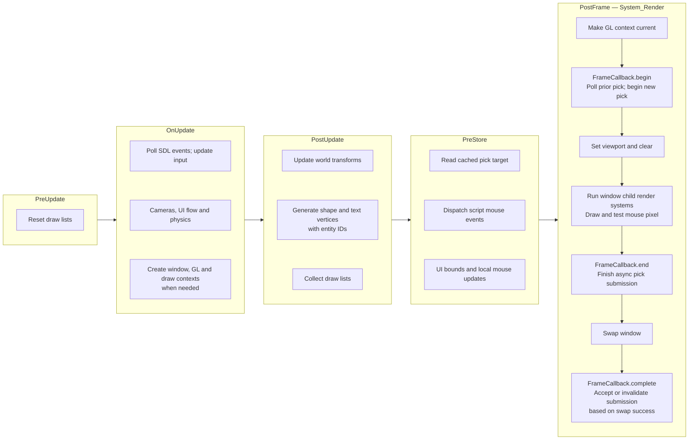

This sketch describes the historical pre-frame-plan implementation. See
[graphics-framework-spec.md](graphics-framework-spec.md) for the current
render contract.

```mermaid
flowchart LR
    subgraph P1["PreUpdate"]
        direction TB
        A1["Reset draw lists"]
    end

    subgraph P2["OnUpdate"]
        direction TB
        B1["Poll SDL events; update input"]
        B2["Cameras, UI flow and physics"]
        B3["Create window, GL and draw contexts<br/>when needed"]
        B1 ~~~ B2 ~~~ B3
    end

    subgraph P3["PostUpdate"]
        direction TB
        C1["Update world transforms"]
        C2["Generate shape and text vertices<br/>with entity IDs"]
        C3["Collect draw lists"]
        C1 ~~~ C2 ~~~ C3
    end

    subgraph P4["PreStore"]
        direction TB
        D1["Read cached pick target"]
        D2["Dispatch script mouse events"]
        D3["UI bounds and local mouse updates"]
        D1 ~~~ D2 ~~~ D3
    end

    subgraph P5["PostFrame — System_Render"]
        direction TB
        E1["Make GL context current"]
        E2["FrameCallback.begin<br/>Poll prior pick; begin new pick"]
        E3["Set viewport and clear"]
        E4["Run window child render systems<br/>Draw and test mouse pixel"]
        E5["FrameCallback.end<br/>Finish async pick submission"]
        E6["Swap window"]
        E7["FrameCallback.complete<br/>Accept or invalidate submission<br/>based on swap success"]
        E1 --> E2 --> E3 --> E4 --> E5 --> E6 --> E7
    end

    P1 --> P2 --> P3 --> P4 --> P5
```
